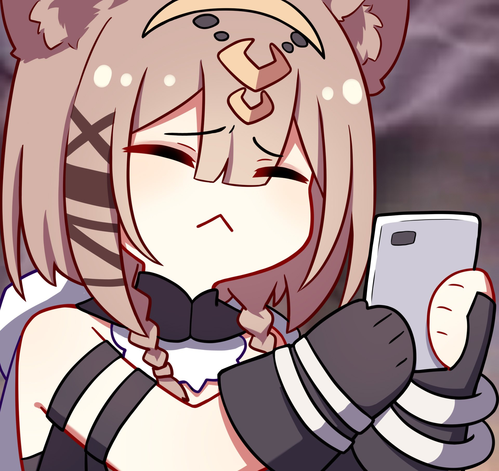
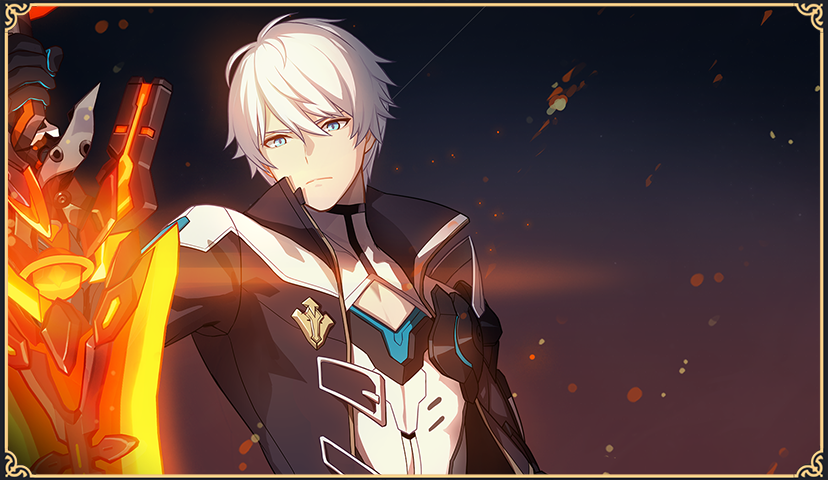
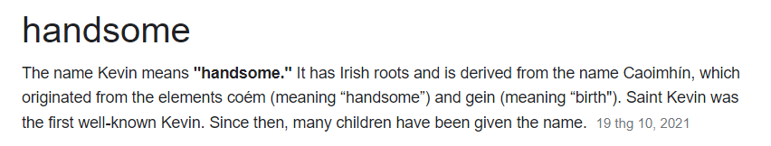
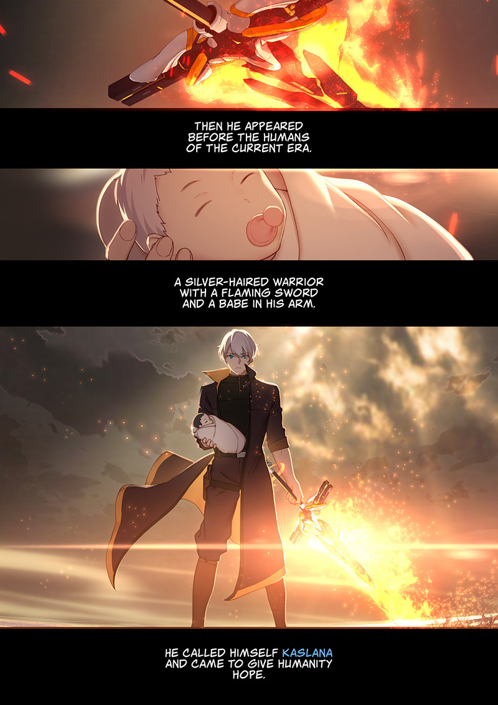

<html>
	<head>
	<title>(ﾉ◕ヮ◕)ﾉ*:･ﾟ✧</title>
	
	</head>

<body style="background-color: #1f1e23;">
<h1 style="color: white;">Ý nghĩa tên 13 Anh Kiệt Trục Hỏa</h1>

  <a href="https://www.hoyolab.com/article/3945625" >Nguồn tham khảo.</a>

Anh Kiệt:

<ul style="color: white; font-size: 150%">
  <li>Kevin</li>
  <li>Elysia</li>
  <li>Aponia</li>
  <li>Eden</li>
  <li>Vill-V</li>
  <li>Su</li>
  <li>Sakura</li>
  <li>Kosma</li>
  <li>Mobius</li>
  <li>Griseo</li>
  <li>Hua</li>
  <li>Pardofelis</li>
</ul> 

<h1 style="color: #1c69ed;">I. Kevin</h1>

✦"Kevin" là một cái tên khá thông dụng cho con trai ở trong Tiếng Anh. Nó bắt nguồn từ chữ “Caoimhín” trong tiếng Ailen cổ, bao gồm hai yếu tố lần lượt là “coém” (nghĩa là “đẹp trai”) và “gein” (nghĩa là “sự ra đời”). Cái tên Kevin trong Tiếng Anh tượng trưng cho một người đàn ông cao ráo, bảnh bao và đẹp trai, hoàn toàn phù hợp với hình tượng của Kevin trong game.

✦ Ngoài ra, Kevin còn có một đứa con với Dr. MEI (do ghép gen). Anh ta đã mang đứa bé này vào buồng ngủ đông, sau 50000 năm Kevin trở lại cùng đứa trẻ và tự gọi mình là “Kaslana”. Đây chính là “sự khai sinh” ra gia tộc “Kaslana” hùng mạnh sau này.

<strong>P.S: </strong>Viết tới đây thôi (Lười).

<table>
  <tr>
    <th colspan="3">Anh Kiệt</th>
    <th colspan="3">Trạng Thái</th>
  </tr>
  <tr>
    <td>Kevin</td>
    <td>Sống</td>
  </tr>
  <tr>
    <td>Elysia</td>
    <td>Chết</td>
  </tr>
  <tr>
    <td>Aponia</td>
    <td>Chết</td>
  </tr>
  <tr>
    <td>Eden</td>
    <td>Chết</td>
  </tr>
  <tr>
    <td>Vill-V</td>
    <td>Chết</td>
  </tr>
  <tr>
    <td>Su</td>
    <td>?</td>
  </tr>
  <tr>
    <td>Sakura</td>
    <td>Chết</td>
  </tr>
  <tr>
    <td>Kosma</td>
    <td>Chết</td>
  </tr>
  <tr>
    <td>Mobius</td>
    <td>?</td>
  </tr>
  <tr>
    <td>Griseo</td>
    <td>Chết</td>
  </tr>
  <tr>
    <td>Hua</td>
    <td>Sống</td>
  </tr>
  <tr>
    <td>Perdofelis</td>
    <td>Chết</td>
  </tr>
</table>

</body>
</html>
