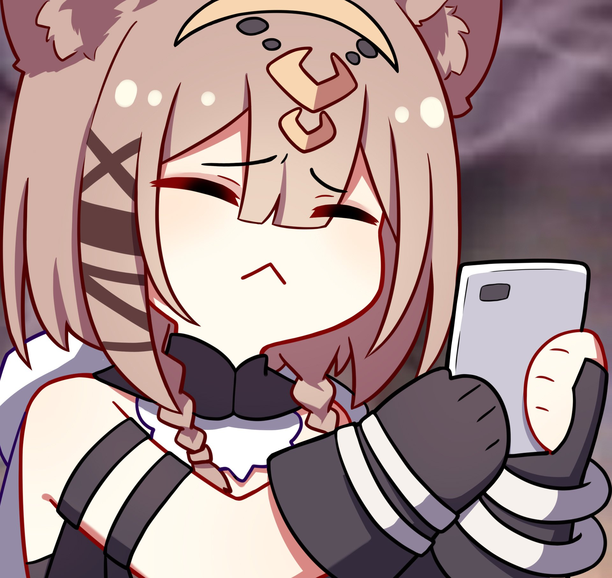
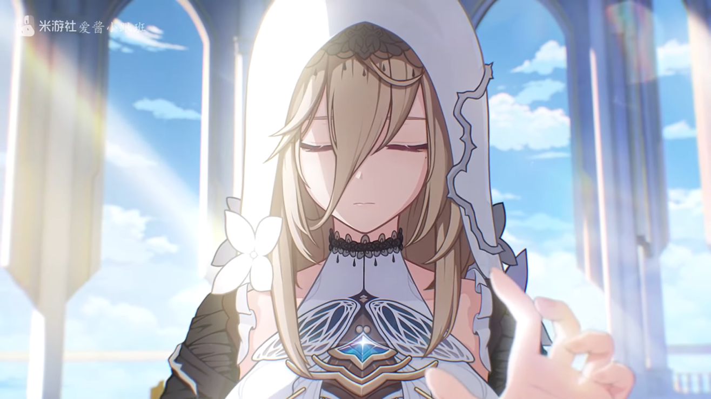
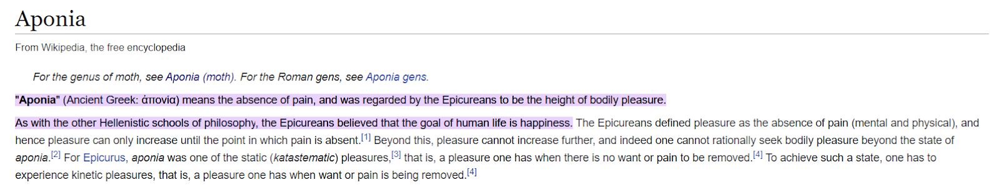

<html>
	<head>
	<title>(ﾉ◕ヮ◕)ﾉ*:･ﾟ✧</title>
	<link rel="icon" type="image/x-icon" href="perdo_phone.jpg">
	
	</head>

<body style="background-color: #1f1e23;">

  <iframe width="560" height="315" src="https://www.youtube.com/embed/fTbMT2mSAmc?autoplay=0&mute=1&controls=1" frameborder="0" allowfullscreen></iframe>
  
Chill with some cute music!!!

<h1 style="color: white;">Ý nghĩa tên 13 Anh Kiệt Trục Hỏa</h1>

  <a href="https://www.hoyolab.com/article/3945625" target="_blank" title="Pardofelis">Nguồn tham khảo.</a>

 

Anh Kiệt Trục Hỏa:

<ul style="color: white; font-size: 150%">
  <li><a href="#Kevin_MOTH">Kevin</a></li>
  <li><a href="#Elysia_MOTH">Elysia</a></li>
  <li><a href="#Aponia_MOTH">Aponia</a></li>
  <li>Eden</li>
  <li>Vill-V</li>
  <li>Su</li>
  <li>Sakura</li>
  <li>Kosma</li>
  <li>Mobius</li>
  <li>Griseo</li>
  <li>Hua</li>
  <li>Pardofelis</li>
</ul> 
 

<h1 id="Kevin_MOTH" style="color: #1c69ed;">I. Kevin</h1>

✦"Kevin" là một cái tên khá thông dụng cho con trai ở trong Tiếng Anh. Nó bắt nguồn từ chữ “Caoimhín” trong tiếng Ailen cổ, bao gồm hai yếu tố lần lượt là “coém” (nghĩa là “đẹp trai”) và “gein” (nghĩa là “sự ra đời”). Cái tên Kevin trong Tiếng Anh tượng trưng cho một người đàn ông cao ráo, bảnh bao và đẹp trai, hoàn toàn phù hợp với hình tượng của Kevin trong game.

✦ Ngoài ra, Kevin còn có một đứa con với Dr. MEI (do ghép gen). Anh ta đã mang đứa bé này vào buồng ngủ đông, sau 50000 năm Kevin trở lại cùng đứa trẻ và tự gọi mình là “Kaslana”. Đây chính là “sự khai sinh” ra gia tộc “Kaslana” hùng mạnh sau này.

 

<h1 id="Elysia_MOTH" style="color: #d767b6;">II. Elysia</h1>

✦ Elysia có xuất phát từ chữ “Elysium” trong ngôn ngữ Hy Lạp cổ, nó mang ý nghĩa liên quan đến “thiên đường”, “vùng đất vui vẻ, hạnh phúc”. “Elysium” cũng còn được gọi là “Cánh đồng Elysian” hoặc “Đồng bằng Elysian”.

✦ Trong thần thoại Hy Lạp, ban đầu nơi này được thiết kế như là thiên đường mà các anh hùng được gửi đến và được các vị thần ban tặng sự bất tử. Theo thời gian, “Elysium” được biến trở thành nơi an nghỉ cuối cùng của anh hùng, những linh hồn may mắn và có đạo đức.

✦ Tên tiếng anh của chế độ “Vùng Đất Xưa Cũ” trong game cũng được đặt dựa theo những ý nghĩa đó, nó là “Elysian Realm”. Vùng đất thiên đường, hạnh phúc, hoàn hảo cho những người anh hùng đã sống cuộc sống chân chính. Cũng đồng thời là nơi an nghỉ cuối cùng của họ.

 

<h1 id="Aponia_MOTH" style="color: #d85e2c;">III. Aponia</h1>

✦ Trong tiếng anh, “Aponia” được dịch nghĩa là “không đau đớn”, là một trạng thái đỉnh cao của cảm nhận của cơ thể. Người Epicurean tin rằng mục tiêu của cuộc sống con người là sự hạnh phúc.

✦ Aponia trong HI3 cũng sở hữu khả năng để làm ra điều “tương tự” như trên. Khắc ấn của cô là “Giới luật”, có sức mạnh liên quan đến tinh thần, nó có thể “ràng buộc” tâm trí con người. Nhờ đó, cô dễ dàng thao túng tâm trí người khác và khiến họ cảm thấy “không đau đớn”, “hạnh phúc” trong thời khắc cuối cùng khi Herrscher of the End xóa sổ nền văn minh.

✦ Ngoài ra, Aponia còn là tên một chi bướm đêm trong tiếng Latin.

✦ Điều này là phù hợp với tạo hình nhân vật này. Aponia đã tiến hành phẫu thuật dung hợp với một con thú Honkai có vẻ giống với bướm, chúng ta có thể dễ dàng nhận ra đặc điểm đó thông qua dạng Honkai của cô.

 

<strong>P.S: </strong>Viết tới đây thôi (Lười).

<table class="center">
  <tr>
    <th>Anh Kiệt</th>
    <th>Trạng Thái</th>
  </tr>
  <tr>
    <td>Kevin</td>
    <td>Còn sống</td>
  </tr>
  <tr>
    <td>Elysia</td>
    <td>Hi sinh</td>
  </tr>
  <tr>
    <td>Aponia</td>
    <td>Hi sinh</td>
  </tr>
  <tr>
    <td>Eden</td>
    <td>Hi sinh</td>
  </tr>
  <tr>
    <td>Vill-V</td>
    <td>Hi sinh</td>
  </tr>
  <tr>
    <td>Su</td>
    <td>?</td>
  </tr>
  <tr>
    <td>Sakura</td>
    <td>Hi sinh</td>
  </tr>
  <tr>
    <td>Kosma</td>
    <td>Hi sinh</td>
  </tr>
  <tr>
    <td>Mobius</td>
    <td>?</td>
  </tr>
  <tr>
    <td>Griseo</td>
    <td>Hi sinh</td>
  </tr>
  <tr>
    <td>Hua</td>
    <td>Còn sống</td>
  </tr>
  <tr>
    <td>Perdofelis</td>
    <td>Hi sinh</td>
  </tr>
</table>

</body>
</html>
